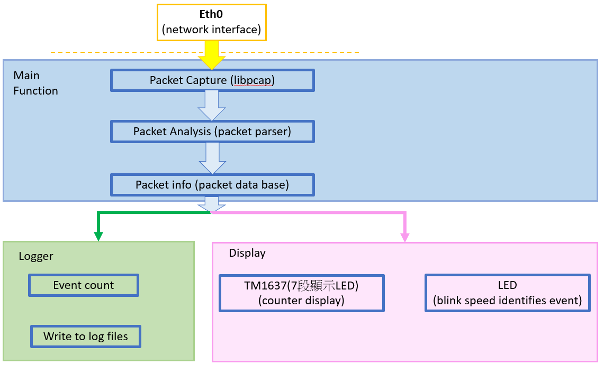

# netmon

`netmon` 是執行於 Raspberry Pi 3 B+／Buildroot Linux 的被動式網路監控程式。系統透過 `libpcap` 擷取封包，解析常見網路協定，依規則輸出 terminal 與 log，並使用 LED 和 TM1637 四位七段顯示器呈現事件。

本專案目前用於觀察與分類 Raspberry Pi 監控介面收到的流量。

## 主要功能

- 解析 Ethernet、ARP、IPv4、ICMP、TCP 與 UDP；IPv6 目前僅辨識封包存在。
- 偵測 ICMP Echo Request、目的 port 22 的 TCP initial SYN，以及短時間內連接多個 destination ports 的行為。
- 將一般事件與警示輸出至 terminal 和結構化文字 log。
- 使用獨立 worker 控制 LED 與 TM1637，避免硬體顯示阻塞封包擷取。
- 依來源統計 sliding window 內的 unique TCP destination ports，預設 10 秒內達 20 個即產生 Port Scan ALERT。

## 系統流程



```text
網路介面 eth0
  -> libpcap 擷取封包
  -> parser 建立 PacketInfo
  -> rules / scan detector 判斷事件
  -> terminal / log
  -> LED worker
  -> display worker -> TM1637
```

主要程式分工：

- `capture.c`、`parser.c`：封包擷取與協定解析。
- `rules.c`、`scan_detector.c`：事件規則、SSH SYN 去重與 Port Scan 偵測。
- `logger.c`：terminal 與 log 輸出。
- `gpio_led.c`：LED 模式。
- `display.c`、`tm1637.c`：顯示計數、輪播及 TM1637 GPIO 通訊。

## 警示與顯示方式

| Type | 偵測行為 | Log | LED | TM1637 |
| --- | --- | --- | --- | --- |
| Type 1 | ICMP Echo Request | INFO | SHORT，亮 100 ms | `1XXX`：啟動後累計數 |
| Type 2 | TCP initial SYN 至 port 22 | ALERT | LONG，亮 500 ms | `2XXX`：去重後累計數 |
| Type 3 | Port Scan 達門檻 | ALERT | RAPID，快速閃爍三次 | `3XXX`：目前單一來源的最大 unique port 數 |

顯示器約每秒依序輪播 Type 1、Type 2、Type 3。Type 1 與 Type 2 在程式重新啟動時歸零；Type 3 會隨 scan window 中的 port 過期而回到 `3000`。三位數值的顯示上限為 999。

## 建置與測試

一般 Linux host 需具備 C11 compiler、pthread 與 libpcap。執行 synthetic test：

```bash
make clean
make
make test-parser
make test-display
```

使用 AArch64 toolchain 並啟用 GPIO：

```bash
make clean
make ENABLE_GPIO=1 CC=/path/to/aarch64-linux-gcc
```

GPIO 版本另需目標環境提供 libgpiod 1.x。切換 compiler 或 `ENABLE_GPIO` 設定前應先執行 `make clean`。

## Raspberry Pi 執行方式

以下是本次實驗使用的 GPIO 配置：LED 為 GPIO17、TM1637 CLK 為 GPIO27、DIO 為 GPIO22。
需依照實際接角修改。

```bash
sudo ./netmon \
  -i eth0 \
  -l /tmp/netmon.log \
  --gpio-chip /dev/gpiochip0 \
  --gpio-line 4 \
  --display tm1637 \
  --display-clk 25 \
  --display-dio 24 \
  --display-brightness 3
```

只使用顯示器時可加入 `--no-led` 並省略 `--gpio-line`。若不使用 TM1637，可省略所有 `--display*` 參數；顯示器預設為停用。

## 實測結果

- Raspberry Pi 實機成功擷取 ICMP、SSH SYN 與 Port Scan 封包，並產生對應 log 與 LED 模式。
- TM1637 啟動後正常輪播 `1000`、`2000`、`3000`；實測顯示 ICMP `1003`、SSH `2001`、Port Scan `3030`。
- Port Scan 包含 port 22，因此 Type 2 隨後增加為 `2002`；掃描視窗過期後 Type 3 回到 `3000`。

完整測試指令、log、pcap 與 tcpdump 紀錄位於 [`finalTest`](finalTest/)，實驗圖片位於 [`image/result`](image/result/)。

## 未來方向

未來希望可以擴充 SYN Flood、ICMP Flood、ARP Spoofing 等偵測規則，並將 Raspberry Pi 建置為 router／network gateway，整合 Linux Netfilter 或 NFQUEUE，使偵測結果能進一步用於封包過濾與主動阻擋。

## 文件

- [實機測試證據](finalTest/)
- [實驗結果圖片](image/result/)
